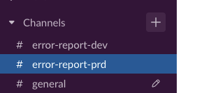
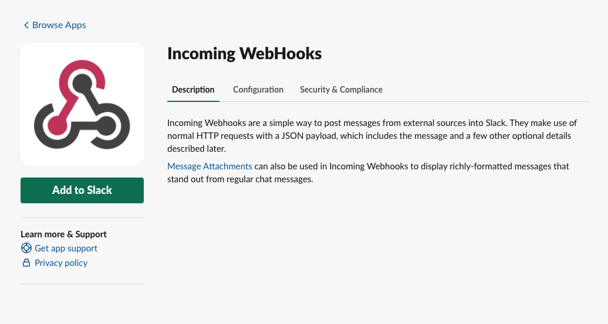
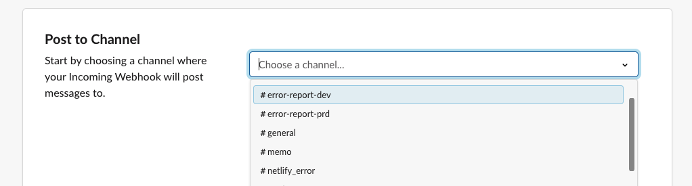
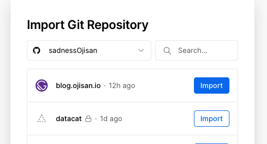
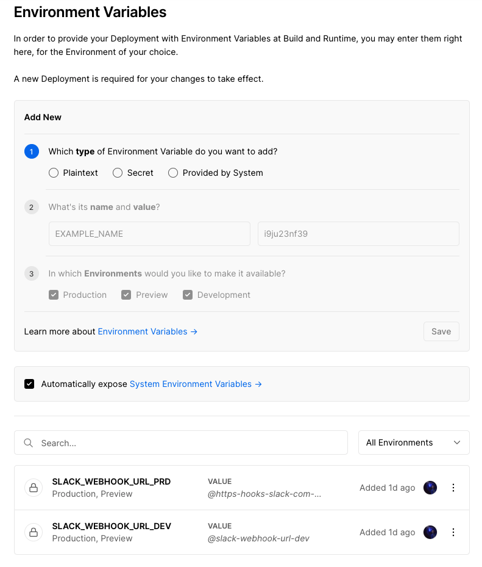

# datacat

Error reporting tool for **free**.

## How to use

1. create slack channel for error loggin

2. get webhook url to notify the channel

add incoming webhook app extension.

https://${your_slack_name}.slack.com/apps

connect your channel

3. fork this repository
4. conect forked repository to Vercel

5. set enviroment variables

this enviroment variables are your slack incoming hook url.
datacat send it log.

You don't need config to build. Because Vercel can build TypeScript and construct API without setting, if we use vercel's serverless functions. The detail is [here](https://vercel.com/docs/serverless-functions/introduction).

6. post message to the endpoint

7. you will get notify in your channel

## Spec

### Endpoint

Host is depends on your deploy.
My example's host is https://datacat.vercel.app

| Endpoint              | Method | Request           |
| --------------------- | ------ | ----------------- |
| /api/report-dev-error | POST   | {message: string} |
| /api/report-prd-error | POST   | {message: string} |
| /api/test             | GET    |                   |

### Enviroment Variables

| Name                  | Description                                                                                                   | required |
| --------------------- | ------------------------------------------------------------------------------------------------------------- | -------- |
| SLACK_WEBHOOK_URL_DEV | Slack Webhook URL for development env                                                                         | x        |
| SLACK_WEBHOOK_URL_PRD | Slack Webhook URL for prd env                                                                                 | o        |
| HOST                  | for cors. this value is for Access-Control-Allow-Origin. If you don't use this, the value is fallback to "\*" | x        |
